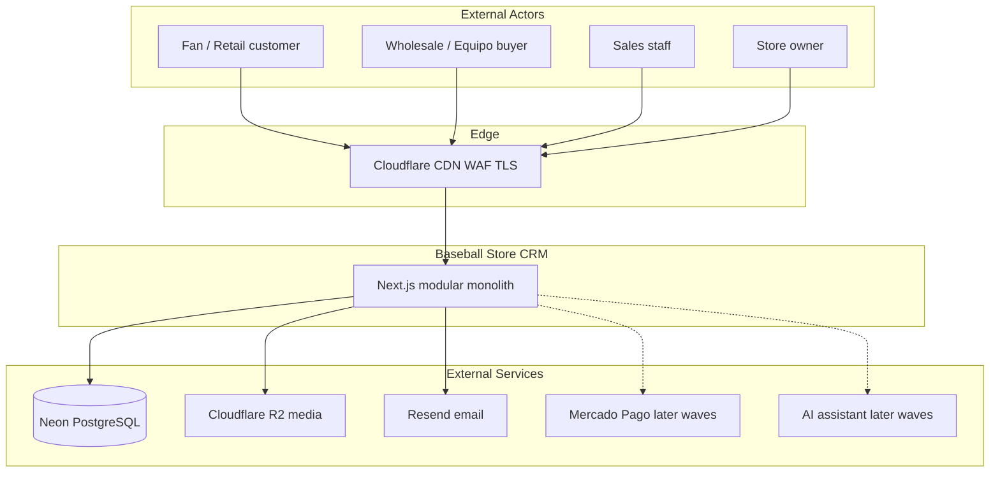
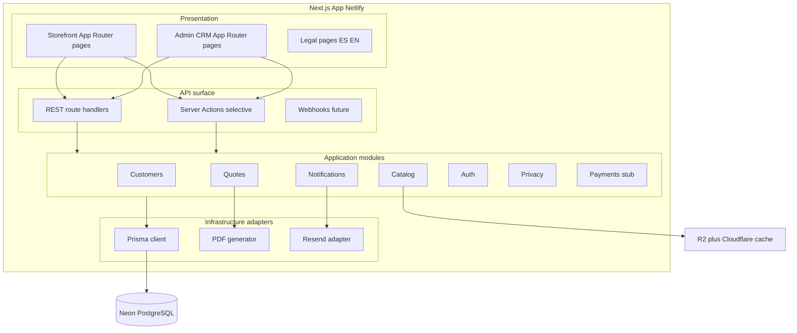
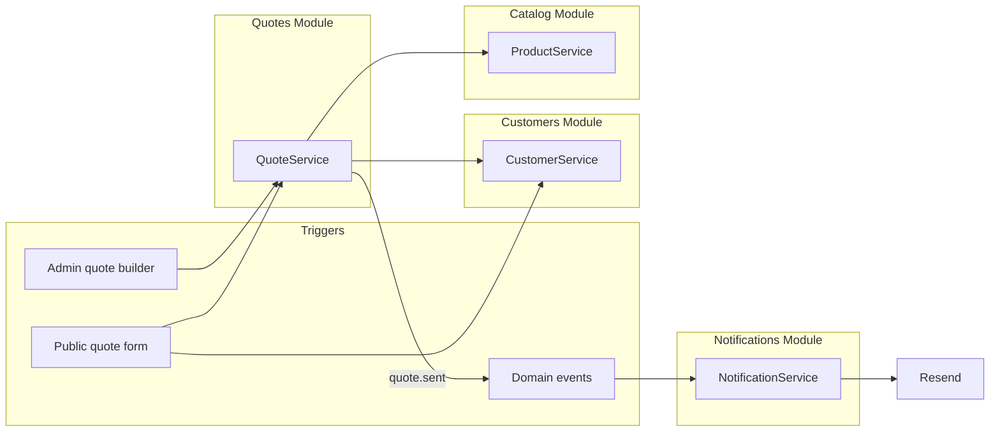
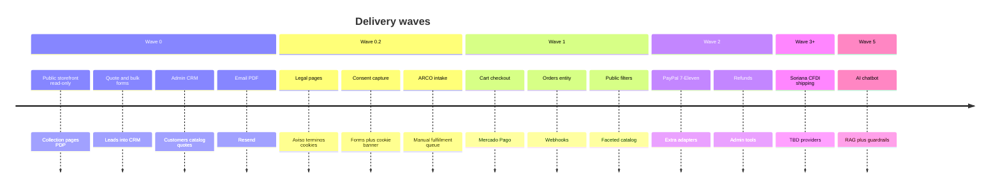
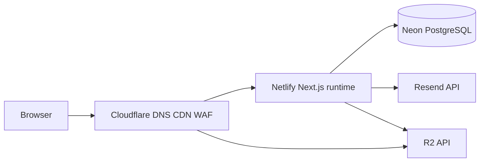

# Website Architecture Plan - Mexico Baseball Store CRM

> **Status:** Target architecture for Wave 0+. A partial, undeployed `app/` scaffold exists (see note below); nothing in this plan is live yet.  
> **Audience:** You (learner), future contributors, AI agents  
> **Last updated:** 2026-07  
> **Next step:** Wire and deploy `app/` per [03-staged-delivery-roadmap.md](./03-staged-delivery-roadmap.md) Stage 0 build order  
> **Delivery stance:** Value first, fast - one custom stack, no parallel ERP platforms  
> **Active stage:** [Stage D - Static demo](./stage-demo-static.md) is the only stage currently deployed

This document is the **single source of truth** for how the website is structured: public storefront, admin CRM, APIs, data, integrations, and delivery waves. Read it before writing code or opening ADRs.

**Reality check (2026-07):** `app/` (Next.js + Prisma) exists in the repo as local scaffolding - not deployed, not connected to a live database anywhere reachable by a customer. Its current storefront and schema also predate [ADR-011-configurator-first](./decisions/ADR-011-configurator-first.md): no configurator UI, no `Design` domain. Everything below is the target design this scaffold is working toward, not a description of what runs today.

---

## 0. Delivery philosophy - value first, fast

**Locked for now:** Build on our modular monolith (Next.js + Prisma + Neon). Do **not** introduce Odoo, Shopify, HubSpot, or other ERP/CRM platforms until a wave gate proves we need them.

| Principle | What it means in practice |
|-----------|---------------------------|
| **One system** | Storefront, admin CRM, quotes, and leads share one database and deploy |
| **Ship Wave 0 before debating platforms** | Replace spreadsheet/WhatsApp chaos in weeks, not months |
| **Buy only commodities** | Netlify, Neon, Cloudflare, Resend, Mercado Pago (later) - not full CRM SaaS |
| **Cut scope, not stack** | If late, drop stretch goals - never split into Odoo + custom storefront |
| **Revisit at Wave 2 gate** | Only evaluate ERP (e.g. Odoo) if inventory/accounting pain is proven |

**Fast path success signal:** Sales sends 80% of quotes through admin within 30 days of launch.

**Start here for staging:** Full phase-by-phase architecture in [03-staged-delivery-roadmap.md](./03-staged-delivery-roadmap.md). Client preview ships first as static demo in `demo/`.

---

## 1. Goals and constraints

### Business goals

| Goal | How architecture supports it |
|------|------------------------------|
| Sell licensed baseball apparel in Mexico | Bilingual storefront, MXN, team/league catalog |
| Quote-first MVP before checkout | Public browse + quote forms; admin CRM backbone |
| Wholesale / equipo orders | Customer types, tier pricing, bulk quote flows |
| LFPDPPP compliance | Privacy module, consent, ARCO hooks from day one |
| Incremental payments | Payment adapter stub -> Mercado Pago waves |

### Technical constraints

| Constraint | Decision |
|------------|----------|
| Solo/small team, learner-friendly | Modular monolith, one repo, one deploy (ADR-002) |
| Low MVP cost | Netlify + Neon free/low tiers (ADR-003, ADR-005) |
| Mexico edge performance | Cloudflare CDN/WAF in front of Netlify (ADR-004) |
| Serverless limits | Heavy work (PDF) in API routes with timeouts in mind; async email via Resend |
| No vendor lock-in on payments | Provider abstraction (ADR-006) |

### UX reference (patterns only)

Licensed jersey retail patterns from [New Era MX jerseys collection](https://www.newera.mx/collections/jerseys) - collection grid, filters, PDP, trust signals. **Do not copy** branding, assets, or copy. See [reference-site-newera-mx.md](../domain/reference-site-newera-mx.md).

---

## 2. C4 Level 1 - System context



**In scope now (Wave 0-0.2):** Storefront (read-only + forms), admin CRM, quotes, email, privacy pages.  
**Later:** Checkout, webhooks, chatbot, POS sync.

---

## 3. C4 Level 2 - Containers

One deployable **Next.js 15** application on Netlify. Logical containers inside the monolith:



### Container responsibilities

| Container | Users | Auth | Primary routes |
|-----------|-------|------|----------------|
| **Storefront** | Public | None (forms create leads) | `/`, `/collections/*`, `/products/[slug]`, `/quote`, `/contact` |
| **Admin CRM** | Staff | Session cookie (Auth.js) | `/admin/*` |
| **Legal** | Public | None | `/aviso-de-privacidad`, `/terminos`, `/cookies`, `/arco` |
| **REST API** | Storefront, admin, future mobile | Session or public read | `/api/*` |

---

## 4. URL and route map

### Storefront (public)

| Route | Wave | Purpose |
|-------|------|---------|
| `/` | 0 | Home - featured collections, trust strip |
| `/collections/jerseys` | 0 | Collection grid (reference IA) |
| `/collections/gorras` | 0 | Collection grid |
| `/collections/[slug]` | 0 | Generic collection |
| `/products/[slug]` | 0 | PDP; CTA **Solicitar cotización** |
| `/quote` | 0 | Multi-item quote request form |
| `/quote/bulk` | 0 | Equipo / mayoreo form |
| `/custom/uniform` | 0 | Custom uniform/cap builder: qty, sizes, roster, decoration type |
| `/contact` | 0 | General contact |
| `/cart` | 1 | Shopping cart |
| `/checkout` | 1 | Checkout + consent |
| `/order/[id]` | 1 | Order status (token or login later) |

**i18n:** `next-intl` with `/es` default and `/en` optional prefix (or domain strategy - decide at scaffold; default **Spanish-first** per ADR-007).

### Admin CRM (staff only)

| Route | Wave | Purpose |
|-------|------|---------|
| `/admin/login` | 0 | Staff login |
| `/admin` | 0 | Dashboard - pipeline KPIs |
| `/admin/customers` | 0 | Customer list + detail |
| `/admin/products` | 0 | Catalog CRUD |
| `/admin/quotes` | 0 | Quote builder + list |
| `/admin/quotes/[id]` | 0 | Detail, PDF preview, send |
| `/admin/leads` | 0 | Inbound web form submissions |
| `/admin/privacy/arco` | 0.2 | ARCO request queue |
| `/admin/orders` | 1 | Orders post-checkout |

Middleware: protect `/admin/*` except `/admin/login`; role checks in layout (`admin`, `sales`, `read-only`).

### API (REST)

| Method | Path | Wave | Auth |
|--------|------|------|------|
| GET | `/api/health` | 0 | Public |
| POST | `/api/auth/login` | 0 | Public |
| POST | `/api/auth/logout` | 0 | Session |
| GET/POST | `/api/customers` | 0 | Staff |
| GET | `/api/products` | 0 | Public read; staff write |
| GET | `/api/products/[slug]` | 0 | Public |
| GET/POST | `/api/quotes` | 0 | Staff |
| POST | `/api/quotes/[id]/send` | 0 | Staff |
| GET | `/api/quotes/[id]/pdf` | 0 | Staff or token |
| POST | `/api/leads/quote` | 0 | Public + rate limit |
| POST | `/api/leads/bulk` | 0 | Public + rate limit |
| POST | `/api/privacy/consent` | 0.2 | Public |
| POST | `/api/privacy/arco` | 0.2 | Public |
| POST | `/api/webhooks/resend` | 0 | Signature |
| POST | `/api/webhooks/mercadopago` | 1 | Signature |

OpenAPI spec lives in `docs/api/` and is generated or maintained alongside routes.

---

## 5. Application layer - module boundaries

Modules match [01-module-map.md](./01-module-map.md). Each module owns Prisma models and exposes a **service interface**; route handlers stay thin.



### Cross-module rules (non-negotiable)

1. No module queries another module's tables directly - go through services.
2. Side effects use domain events (`quote.sent`, `lead.created`, `consent.recorded`).
3. Shared types only in `src/shared/` (`Money`, `Locale`, `Result`, Zod schemas).
4. Feature flags per wave in env (`PAYMENTS_ENABLED`, `PUBLIC_CHECKOUT`).

---

## 6. Data architecture

**Database:** Neon PostgreSQL, TLS, connection pooling (Prisma + Neon adapter).

**Money:** `amount_cents BIGINT`, `currency = 'MXN'`.

**Core entities by wave:**

| Entity | Wave | Owner module |
|--------|------|--------------|
| `customers` | 0 | Customers |
| `products`, `product_variants`, `product_images` | 0 | Catalog |
| `quotes`, `quote_line_items` | 0 | Quotes |
| `users` (staff) | 0 | Auth |
| `leads` (web form capture) | 0 | Customers |
| `consent_records` | 0.2 | Privacy |
| `arco_requests` | 0.2 | Privacy |
| `orders`, `order_line_items` | 1 | Orders (new module) |
| `payment_intents` | 1 | Payments |

Full SQL sketches: [schema-design-guide.md](../data/schema-design-guide.md).

### Media

Product images in **Cloudflare R2**; DB stores URL + alt text + sort order. Storefront uses `next/image` with allowed R2/CF domains.

---

## 7. Authentication and authorization

| Actor | Mechanism | Wave |
|-------|-----------|------|
| Staff | Auth.js credentials provider, HTTP-only session cookie | 0 |
| Public forms | No login; honeypot + rate limit + Turnstile optional | 0 |
| Quote PDF link | Signed token URL (optional stretch) | 0 |
| Customer account | Email magic link or OAuth | 2+ |

**Roles:**

| Role | Permissions |
|------|-------------|
| `admin` | Full CRUD, privacy tools, user management |
| `sales` | Customers, quotes, catalog read, send quote |
| `read-only` | Dashboard + export |

---

## 8. Wave delivery map

Architecture is **shippable per wave** - each wave deploys without blocking the next.



| Wave | Storefront | Admin | Integrations |
|------|------------|-------|--------------|
| **0** | Home, collections, PDP, quote forms | CRM, quotes, PDF, dashboard | Resend, Neon, R2 |
| **0.2** | Legal footer links, consent UI | ARCO queue | - |
| **1** | Cart, checkout | Orders | Mercado Pago, webhooks |
| **2** | More payment methods | Refunds | PayPal, 7-Eleven |
| **5** | Chat widget | Knowledge admin | LLM + vector store |

Detail: [wave-zero-quote-crm.md](./wave-zero-quote-crm.md), [payments roadmap](../business/mexico-payments-roadmap.md).

---

## 9. Key user flows (website)

### Flow A - Fan browses and requests quote (Wave 0)

```
Storefront /collections/jerseys
  -> /products/padres-home-jersey
  -> CTA "Solicitar cotización" (pre-filled SKU)
  -> /quote form (name, email, phone, consent)
  -> POST /api/leads/quote
  -> Customer + draft quote OR lead record
  -> Email to sales (Resend)
  -> Sales completes quote in /admin/quotes
  -> Send PDF to customer
```

### Flow B - Sales-built quote (Wave 0)

See [wave-zero-quote-crm.md](./wave-zero-quote-crm.md) - admin-first path.

### Flow C - Checkout OXXO (Wave 1)

See Journey 4 in [user-journeys.md](../domain/user-journeys.md).

---

## 10. Frontend architecture

### Stack

| Layer | Choice | ADR |
|-------|--------|-----|
| Framework | Next.js 15 App Router | ADR-001 |
| Language | TypeScript strict | ADR-001 |
| Styling | Tailwind CSS + shadcn/ui | - |
| i18n | next-intl (es-MX default, en) | ADR-007 |
| Forms | React Hook Form + Zod | - |
| Data fetching | Server Components + fetch/cache; client where needed | - |

### Layout structure

```
src/app/
  [locale]/
    (storefront)/
      layout.tsx          # Header, footer, legal links
      page.tsx            # Home
      collections/...
      products/[slug]/...
      quote/...
    (admin)/
      admin/
        layout.tsx        # Sidebar, auth guard
        page.tsx          # Dashboard
        ...
  api/                    # Route handlers
```

**As-built note (2026-07):** `app/src/app/` does not have a `[locale]` segment yet - routes are flat (`src/app/page.tsx`, `src/app/quote/page.tsx`, `src/app/admin/page.tsx`, etc.), and `next-intl` is a `package.json` dependency with no actual usage in the code. Bilingual routing per this layout has not been started; the only bilingual UI shipped so far is the Stage D demo's client-side toggle in `demo/js/i18n.js` / `demo/js/messages.js`, which is a different (non-Next.js) mechanism and won't carry over directly.

### Storefront components (planned)

| Component | Responsibility |
|-----------|----------------|
| `SiteHeader` | Nav, locale switcher, cart icon (Wave 1) |
| `CollectionGrid` | Product cards, responsive grid |
| `ProductCard` | Image, price MXN, badge |
| `ProductGallery` | PDP images |
| `SizeSelector` | Variant selection |
| `QuoteCTA` | Links to quote form with query params |
| `ConsentCheckbox` | LFPDPPP linked label |
| `LegalFooter` | Aviso, términos, cookies, ARCO |

### State

| State | Storage |
|-------|---------|
| Cart (Wave 1) | Cookie or DB guest cart |
| Locale | URL segment / cookie |
| Admin session | Auth.js session |

No global client state library required for Wave 0.

---

## 11. Backend and integration architecture

### Email (Resend)

- Templates: `quote-sent-es`, `lead-notify-staff-es`, `order-confirmed-es` (Wave 1)
- Domain: client subdomain with SPF/DKIM
- Webhook: bounces -> log in notifications module

### PDF generation

- Library: `@react-pdf/renderer` or `puppeteer` (evaluate at scaffold; prefer lighter option for Netlify)
- Template: logo, line items, MXN totals, validity date, store RFC block (footer)

### Payments (stub -> live)

Interface in Payments module; mock adapter in dev. See [payment-provider-abstraction.md](./payment-provider-abstraction.md).

### Observability (minimal Wave 0)

- Structured logs in API routes (no PII in logs)
- Netlify function logs + optional Sentry later
- Health check `/api/health` for uptime

---

## 12. Security architecture

| Concern | Mitigation |
|---------|------------|
| OWASP top 10 | Parameterized queries (Prisma), Zod validation, CSRF on mutations |
| Admin exposure | Middleware auth, separate layout, no index on `/admin` |
| Public forms | Rate limit (Netlify/CF), honeypot, optional Turnstile |
| PII | TLS everywhere; minimal retention; ARCO path documented |
| Webhooks | HMAC signature verification |
| Secrets | Netlify env vars only; never in client bundle |

Security review skill/agent before Wave 1 payments go live.

---

## 13. Deployment topology

> **Not deployed yet.** The only live Netlify site today publishes `demo/` as a static bundle - no Cloudflare, no Next.js runtime, no Neon, no Resend, no R2. This diagram is the target for when Stage 0 ships.



| Environment | Branch | Purpose |
|-------------|--------|---------|
| Production | `main` | Live store |
| Preview | PR branches | QA per feature |
| Local | - | `pnpm dev` + Neon branch or Docker Postgres |

Env vars (minimum): `DATABASE_URL`, `AUTH_SECRET`, `RESEND_API_KEY`, `R2_*`, `NEXT_PUBLIC_SITE_URL`.

Guide: [netlify-cloudflare-guide.md](../hosting/netlify-cloudflare-guide.md) (create at scaffold if missing).

---

## 14. Repository layout (Phase 2 scaffold)

```
RS/
  docs/                    # Planning (this repo today)
  templates/               # Legal, email, PDF templates
  app/                     # Next.js project (Phase 2)
    src/
      app/                 # App Router
      modules/
        customers/
        catalog/
        quotes/
        notifications/
        auth/
        privacy/
        payments/
      shared/
      lib/
    prisma/
      schema.prisma
    public/
    tests/
  .cursor/                 # Agents, skills, rules
```

**Decision:** Keep `app/` as sibling to `docs/` so planning toolkit stays separate from runnable code.

**As-built note (2026-07):** `app/` exists but does not follow the `modules/{customers,catalog,quotes,...}` domain-folder layout above - the actual tree is flatter (`src/lib/services/*Service.ts` per domain, `src/app/api/*` route handlers, no `src/modules/` directory, no `[locale]` route segment despite `next-intl` being a dependency). Reconcile this doc with the real layout once the module-folder structure is actually adopted, or update the doc to match the flatter layout if that's the accepted direction.

---

## 15. Architecture decisions index

| ADR | Topic |
|-----|-------|
| ADR-001 | Next.js + TypeScript stack |
| ADR-002 | Modular monolith |
| ADR-003 | Neon PostgreSQL |
| ADR-004 | Cloudflare edge |
| ADR-005 | Netlify hosting |
| ADR-006 | Payment provider abstraction |
| ADR-007 | next-intl bilingual |
| ADR-008 | Resend transactional email |
| ADR-009 | REST + OpenAPI |
| ADR-010 | Zod validation boundary |

All in [decisions/](./decisions/).

---

## 16. Open questions (resolve at scaffold)

| # | Question | Default if no answer |
|---|----------|----------------------|
| 1 | URL i18n: `/es/...` prefix vs cookie-only? | `/es` default locale in path |
| 2 | Prisma vs Drizzle? | Prisma (matches agent docs) |
| 3 | PDF library on Netlify? | Spike in scaffold week 1 |
| 4 | Guest quote token URLs? | Defer to stretch |
| 5 | Turnstile on forms? | Yes in production |

---

## 17. Implementation sequence (value-first)

Use this order when you say **"scaffold the app"**. **Critical path first** - admin quote value before polish.

### Phase A - Internal value (weeks 1-3) 

1. **Bootstrap** - `app/` Next.js 15, Prisma, Neon, Tailwind, shadcn
2. **Auth** - Admin login + middleware
3. **Catalog** - Prisma models, admin CRUD, seed 2-3 teams
4. **Quotes** - Admin quote builder + PDF + Resend send
5. **Dashboard** - Pipeline counts by status

*Stop and validate with sales here. If quotes flow, Wave 0 is winning.*

### Phase B - Public surface (weeks 3-5)

6. **Storefront** - Home + one collection (`/collections/jerseys`) + PDP
7. **Leads** - Public `/quote` form -> staff email + lead record
8. **Deploy** - Netlify + Cloudflare + Resend domain

### Phase C - Compliance & growth (after live)

9. **Wave 0.2** - Legal pages + consent + ARCO form
10. **Wave 1** - Cart, Mercado Pago (separate plan; only after Wave 0 metrics hit)

### Explicitly deferred (not in plan)

| Item | Revisit when |
|------|----------------|
| Odoo / ERP integration | Wave 2 gate + proven inventory/accounting pain |
| Shopify / Tiendanube | Wave One gate if custom maintenance ROI is negative |
| B2B self-service portal | After wholesale quote volume justifies it |
| AI chatbot | Wave 5 |

---

## 18. Related documents

| Doc | Purpose |
|-----|---------|
| [00-system-context.md](./00-system-context.md) | Stakeholders and boundary |
| [01-module-map.md](./01-module-map.md) | Module responsibilities |
| [wave-zero-quote-crm.md](./wave-zero-quote-crm.md) | Wave 0 feature scope |
| [reference-site-newera-mx.md](../domain/reference-site-newera-mx.md) | UX patterns |
| [user-journeys.md](../domain/user-journeys.md) | End-to-end journeys |
| [schema-design-guide.md](../data/schema-design-guide.md) | Database shapes |
| [payment-provider-abstraction.md](./payment-provider-abstraction.md) | Payments design |

---

## 19. How to use this plan with Cursor

| Task | Agent / skill |
|------|----------------|
| Refine a module | `solution-architect` + `define-architecture` |
| Storefront UI | `frontend-engineer` + `storefront-ux-analyst` |
| API routes | `api-designer` + `backend-engineer` |
| Database | `data-modeler` |
| Privacy pages | `privacy-compliance-advisor` |
| Payments wave | `payments-integration-mexico` |

When starting implementation, point the agent at **this file** and the specific wave section.
