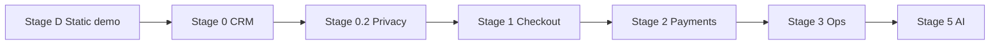
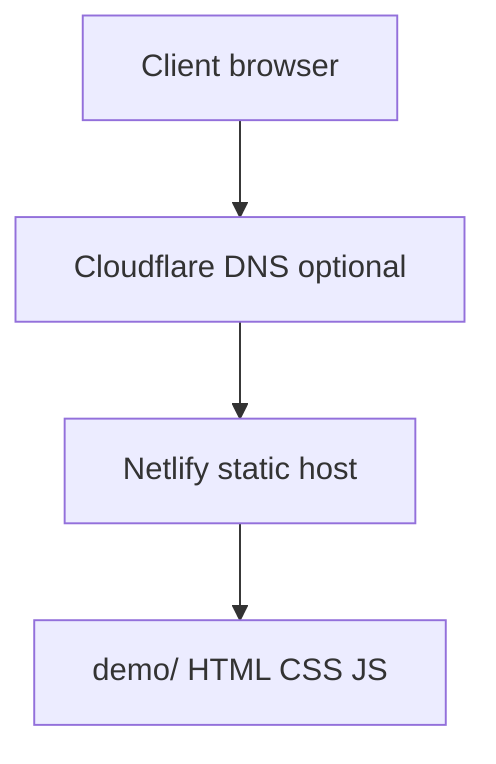
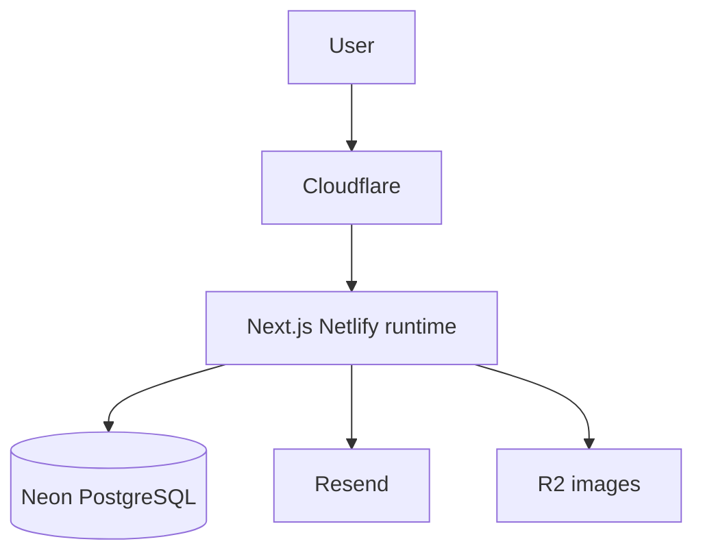
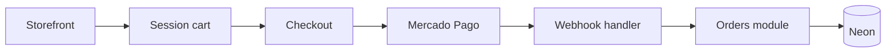

# Staged Delivery Roadmap - Full Architecture by Phase

> **Status:** Planning (active)  
> **Audience:** Client validation, developers, AI agents  
> **Last updated:** 2026-07  
> **Companion docs:** [02-website-architecture-plan.md](./02-website-architecture-plan.md), [stage-demo-static.md](./stage-demo-static.md)

This document maps **every delivery stage** from the first customer-facing preview through production waves. Each stage has its own architecture slice: what runs, what connects, what ships, and how you know it is done.

---

## Stage overview

| Stage | Name | Runtime | Database | Customer sees | Your goal |
|-------|------|---------|----------|---------------|-----------|
| **D** | Static demo | HTML/CSS/JS on Netlify | None | Storefront + fake admin UI | Fast visual validation (es-MX + en) |
| **0** | Wave 0 CRM | Next.js on Netlify | Neon | Real admin; real storefront forms | Quotes replace spreadsheets |
| **0.2** | Privacy | Same app | Same | Legal pages + consent | LFPDPPP baseline |
| **1** | Commerce | Same app | Same + orders | Cart + checkout | Online sales |
| **2** | Payments+ | Same app | Same | More payment methods | Broader checkout |
| **3** | Ops depth | Same app | Same + integrations | Shipping, invoicing hooks | Back-office scale |
| **5** | AI assist | Same app | Same + vector index | Chat widget | Support deflection |



**Rule:** Each stage deploys independently. Do not skip Stage D if the client has not seen the UX yet. Do not start Stage 1 until Stage 0 quote metrics pass the gate.

---

## Stage D - Static demo (NOW)

### Purpose

Show the client **look, navigation, and key flows** before backend work. No real data, no login, no payments. Deploy to their domain within days.

### Architecture



| Layer | Technology | Notes |
|-------|------------|-------|
| Hosting | Netlify | Publish directory `demo/`; no build step |
| DNS | Client domain or `*.netlify.app` | See [demo-dns-netlify-setup.md](../hosting/demo-dns-netlify-setup.md) |
| Assets | Local SVG/placeholder images | Replace with client photos later |
| State | `sessionStorage` only | Cart preview optional; forms show toast only |

### Pages (demo)

| Path | Screen |
|------|--------|
| `/` | Home - hero, featured jerseys, trust strip |
| `/collections/jerseys.html` | Collection grid + filter chips |
| `/products/*.html` | PDP - gallery, size, quote CTA |
| `/quote/` | Retail quote form (fake submit) |
| `/quote/bulk.html` | Equipo / mayoreo form |
| `/admin/` | CRM dashboard mock |
| `/admin/quotes.html` | Quote list mock |
| `/admin/quotes/detail.html` | Quote builder mock |

### Interactions (client-side only)

- Navigate full storefront + admin shells
- Filter collection by team (JS)
- Select size on PDP
- Submit forms -> success banner ("Demo: en produccion esto envia al CRM")
- Responsive mobile nav

### Explicitly fake

- Login, PDF download, email send, database, payments, inventory counts

### Exit criteria (proceed to Stage 0)

| Signal | Target |
|--------|--------|
| Client approves layout and navigation | Written OK or change list |
| Copy and MXN format acceptable | Spanish-first confirmed |
| Quote-first CTA approved | No demand for checkout in demo |
| Domain live | Client can open URL on phone |

Full spec: [stage-demo-static.md](./stage-demo-static.md).

---

## Stage 0 - Wave 0 (real CRM)

### Purpose

Internal value first: sales creates and sends real quotes; public site captures leads. Modular monolith on Next.js.

### Architecture delta (vs Stage D)



| Added | Removed from demo |
|-------|-------------------|
| Prisma + Neon | Hardcoded product JSON in HTML |
| Auth.js staff sessions | Open admin URLs |
| REST API `/api/*` | Fake form toasts |
| PDF generation | Static PDF preview |
| Resend email | - |

### Build order (Stage 0)

1. Bootstrap `app/` - Next.js 15, Prisma, Neon
2. Admin auth + middleware
3. Catalog admin CRUD + seed
4. Quote builder + PDF + Resend
5. Dashboard KPIs
6. Storefront: home, jerseys collection, PDP
7. Public quote + bulk forms -> leads API
8. Deploy production branch

Detail: [wave-zero-quote-crm.md](./wave-zero-quote-crm.md), section 17 in [02-website-architecture-plan.md](./02-website-architecture-plan.md).

### Modules active

Customers, Catalog, Quotes, Notifications, Auth, Payments (mock adapter only)

### Routes added (vs demo)

Real `/api/customers`, `/api/products`, `/api/quotes`, `/api/leads/quote`, `/admin/login`

### Exit criteria

| Metric | Target |
|--------|--------|
| Quotes in system | 80% of quotes within 30 days |
| Time to send quote | Under 5 minutes |
| Sales weekly login | 100% of team |

---

## Stage 0.2 - Privacy and legal

### Purpose

LFPDPPP baseline before marketing push or heavy public traffic.

### Architecture delta

| Added | Module |
|-------|--------|
| `/aviso-de-privacidad`, `/terminos`, `/cookies`, `/arco` | Legal pages |
| Consent on all forms | Privacy module |
| `consent_records`, `arco_requests` tables | Privacy module |
| `/admin/privacy/arco` queue | Admin |

No new deployable service. Same Netlify app, new routes and DB tables.

### Exit criteria

- Lawyer-reviewed aviso published
- Consent checkbox on every data collection form
- ARCO form submits to admin queue

Docs: [../legal/mexico-privacy-framework.md](../legal/mexico-privacy-framework.md)

---

## Stage 1 - Storefront commerce

### Purpose

Cart, checkout, Mercado Pago (cards, OXXO, wallet), orders linked to quotes.

### Architecture delta



| Added | Module |
|-------|--------|
| `orders`, `order_line_items`, `payment_intents` | Orders + Payments |
| Mercado Pago adapter (live) | Payments |
| `/cart`, `/checkout`, `/order/[id]` | Storefront |
| `/api/webhooks/mercadopago` | API |
| `/admin/orders` | Admin |
| Public catalog filters | Catalog |

### Security checkpoint

`security-reviewer` (Opus) sign-off before go-live.

### Exit criteria

| Metric | Target |
|--------|--------|
| Online orders | 5+ per week after 90 days marketing |
| Webhook reliability | 99%+ payment confirmations |
| OXXO flow tested | Sandbox + one real txn |

Docs: [payment-provider-abstraction.md](./payment-provider-abstraction.md), [../business/payment-methods-roadmap.md](../business/payment-methods-roadmap.md)

---

## Stage 2 - Extended payments and refunds

### Purpose

PayPal, 7-Eleven (if provider ready), refund workflow, wholesale order records.

### Architecture delta

| Added | Notes |
|-------|-------|
| Second payment adapter | Same `PaymentProvider` interface |
| Refund admin actions | Staff-only |
| B2B order from accepted quote | Quote -> order conversion |

Same monolith. Feature flags per provider.

### Exit criteria

- Two providers live in production
- Refund documented and tested
- Reconciliation report for owner

---

## Stage 3 - Operations depth

### Purpose

Shipping labels, CFDI export (via factura.com or similar), inventory CSV/POS sync, Soriana if scoped.

### Architecture delta

| Added | Approach |
|-------|----------|
| Shipping adapter | Buy (Estafeta partner API) |
| CFDI | Buy; export from orders, not in-app SAT |
| Inventory sync | Hybrid CSV first, API later |
| Customer accounts | Optional magic link |

**Deferred:** Odoo/ERP unless Wave 2 gate passed.

### Exit criteria

- Shipping status on order detail
- Invoice export for paid orders
- Inventory updated weekly without double entry

---

## Stage 5 - AI assistant

### Purpose

FAQ deflection, size guidance, quote handoff. Not autonomous pricing or payments.

### Architecture delta

```mermaid
flowchart TB
  Widget[Chat widget] --> API[/api/chat]
  API --> RAG[RAG catalog + FAQs]
  API --> LLM[LLM provider]
  API --> Guard[Guardrails + rate limit]
```

Phased: static FAQ (0) -> RAG Q&A (1) -> tools (2) -> staff copilot (3). See [ai-chatbot-roadmap.md](./ai-chatbot-roadmap.md).

### Exit criteria

- 30% FAQ deflection at Phase 1
- Under 2% wrong-answer complaints
- No PII in model logs

---

## Deployment topology by stage

| Stage | Netlify publish | Build command | DB | Email |
|-------|-----------------|---------------|-----|-------|
| D | `demo/` | none | - | - |
| 0-5 | `app/` (Next output) | `npm run build` | Neon | Resend |

### Domain strategy

| Phase | URL pattern |
|-------|-------------|
| Demo | `demo.clientdomain.mx` or apex `clientdomain.mx` pointing to demo |
| Stage 0+ | Same domain; swap Netlify publish from `demo/` to Next app when ready |

Recommended: use **apex domain for demo now**; add `app.` subdomain later only if you need parallel demo + prod. Simpler: replace demo folder deploy with Next app on same domain when Stage 0 launches.

---

## Repository layout by stage

```
RS/
  demo/                 # Stage D (static) - ACTIVE NOW
  app/                  # Stage 0+ (Next.js) - created at scaffold
  docs/
  templates/
  netlify.toml          # Points to demo/ until Stage 0
```

When Stage 0 ships, update `netlify.toml` build settings for `app/`.

---

## Decision gates between stages

| Gate | Question | If no |
|------|----------|-------|
| D -> 0 | Client approved UX? | Revise demo, do not scaffold |
| 0 -> 0.2 | Quotes flowing in CRM? | Fix adoption, not privacy polish |
| 0.2 -> 1 | Legal pages live? | Do not run paid ads |
| 1 -> 2 | Online revenue worth second provider? | Stay on Mercado Pago only |
| 2 -> 3 | Ops pain on shipping/invoices? | Defer Stage 3 |
| 3 -> 5 | Support load justifies AI cost? | Stay with static FAQ |

---

## What to do right now

| Who | Action |
|-----|--------|
| You | Purchase domain; connect to Netlify per [demo-dns-netlify-setup.md](../hosting/demo-dns-netlify-setup.md) |
| Dev | Static demo in `demo/` (this repo) |
| Client | Browse demo on phone; send change list |
| After approval | Say "scaffold the app" for Stage 0 |

---

## Related documents

| Doc | Purpose |
|-----|---------|
| [02-website-architecture-plan.md](./02-website-architecture-plan.md) | Module and route detail |
| [stage-demo-static.md](./stage-demo-static.md) | Demo page and interaction spec |
| [demo-dns-netlify-setup.md](../hosting/demo-dns-netlify-setup.md) | DNS + Netlify for Stage D |
| [wave-zero-quote-crm.md](./wave-zero-quote-crm.md) | Stage 0 features |
| [hybrid-mvap-paths.md](../business/hybrid-mvap-paths.md) | Business path alignment |
