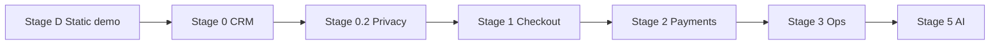
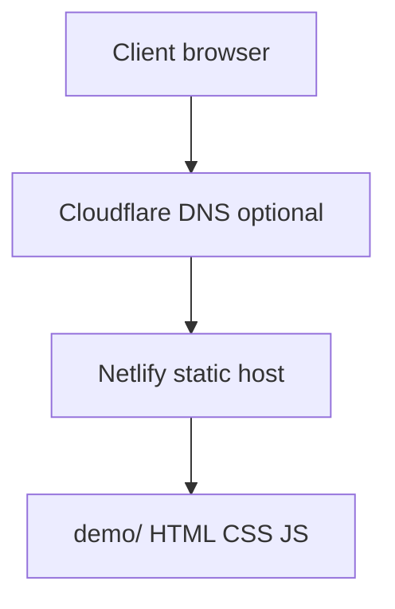
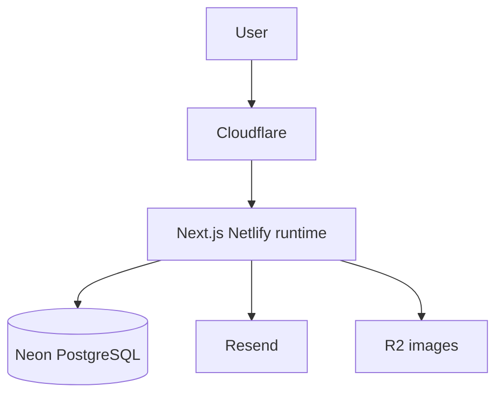
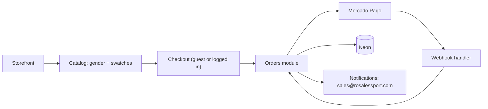

# Staged Delivery Roadmap - Full Architecture by Phase

> **Status:** Planning (active)  
> **Audience:** Client validation, developers, AI agents  
> **Last updated:** 2026-07  
> **Companion docs:** [02-website-architecture-plan.md](./02-website-architecture-plan.md), [stage-demo-static.md](./stage-demo-static.md)

This document maps **every delivery stage** from the first customer-facing preview through production waves. Each stage has its own architecture slice: what runs, what connects, what ships, and how you know it is done.

---

## Stage overview

| Stage | Name | Runtime | Database | Customer sees | Your goal |
|-------|------|---------|----------|---------------|-----------|
| **D** | Static demo | HTML/CSS/JS on Netlify | None | Storefront + fake admin UI | Fast visual validation (es-MX + en) |
| **0** | Wave 0 CRM | Next.js on Netlify | Neon | Real admin; real storefront forms | Quotes replace spreadsheets |
| **0.2** | Privacy | Same app | Same | Legal pages + consent | LFPDPPP baseline |
| **1** | Commerce (expanded) | Same app | Same + orders/payments | Guest/account checkout, split payments, order tracking | Online sales, in owner priority order: new customers -> payments -> accounts |
| **2** | Payments+ | Same app | Same | More payment methods | Broader checkout |
| **3** | Ops depth | Same app | Same + integrations | Shipping, invoicing hooks | Back-office scale |
| **5** | AI assist | Same app | Same + vector index | Chat widget | Support deflection |



**Rule:** Each stage deploys independently. Do not skip Stage D if the client has not seen the UX yet. Do not start Stage 1 until Stage 0 quote metrics pass the gate.

---

## Stage D - Static demo (NOW)

### Purpose

Show the client **look, navigation, and key flows** before backend work. No real data, no login, no payments. Deploy to their domain within days.

### Architecture



| Layer | Technology | Notes |
|-------|------------|-------|
| Hosting | Netlify | Publish directory `demo/`; no build step |
| DNS | Client domain or `*.netlify.app` | See [demo-dns-netlify-setup.md](../hosting/demo-dns-netlify-setup.md) |
| Assets | Local SVG/placeholder images | Replace with client photos later |
| State | `sessionStorage` only | Cart preview optional; forms show toast only |

### Pages (demo)

| Path | Screen |
|------|--------|
| `/` | Home - hero, featured jerseys, trust strip |
| `/collections/jerseys.html` | Collection grid + filter chips |
| `/products/*.html` | PDP - gallery, size, quote CTA |
| `/quote/` | Retail quote form (fake submit) |
| `/quote/bulk.html` | Equipo / mayoreo form |
| `/admin/` | CRM dashboard mock |
| `/admin/quotes.html` | Quote list mock |
| `/admin/quotes/detail.html` | Quote builder mock |

### Interactions (client-side only)

- Navigate full storefront + admin shells
- Filter collection by team (JS)
- Select size on PDP
- Submit forms -> success banner ("Demo: en produccion esto envia al CRM")
- Responsive mobile nav

### Explicitly fake

- Login, PDF download, email send, database, payments, inventory counts

### Exit criteria (proceed to Stage 0)

| Signal | Target |
|--------|--------|
| Client approves layout and navigation | Written OK or change list |
| Copy and MXN format acceptable | Spanish-first confirmed |
| Quote-first CTA approved | No demand for checkout in demo |
| Domain live | Client can open URL on phone |

Full spec: [stage-demo-static.md](./stage-demo-static.md).

---

## Stage 0 - Wave 0 (real CRM)

> **Status (2026-07): scaffolded, not deployed.** `app/` has a local Next.js + Prisma + NextAuth scaffold (build order steps 1-4 partially done: routes, services, and schema exist for Customers/Products/Quotes/Leads), but it has never been deployed - no `netlify.toml` targets `app/`, and `demo/` remains the only live site. `quotePdf.ts` still has no caller. `app/`'s current storefront and schema also predate [ADR-011-configurator-first](./decisions/ADR-011-configurator-first.md) - there is no configurator UI or `DesignRequest` model in `app/` yet, so the primary-journey pivot from that ADR has not been carried into Stage 0 work. Treat the rest of this section as the target design for Stage 0, not a description of what's running today - see Stage 1 below for what actually exists now.

### Purpose

Internal value first: sales creates and sends real quotes; public site captures leads. Modular monolith on Next.js.

### Architecture delta (vs Stage D)



| Added | Removed from demo |
|-------|-------------------|
| Prisma + Neon | Hardcoded product JSON in HTML |
| Auth.js staff sessions | Open admin URLs |
| REST API `/api/*` | Fake form toasts |
| PDF generation | Static PDF preview |
| Resend email | - |

### Build order (Stage 0)

1. Bootstrap `app/` - Next.js 15, Prisma, Neon
2. Admin auth + middleware
3. Catalog admin CRUD + seed
4. Quote builder + PDF + Resend
5. Dashboard KPIs
6. Storefront: home, jerseys collection, PDP
7. Public quote + bulk forms -> leads API
8. Deploy production branch

Detail: [wave-zero-quote-crm.md](./wave-zero-quote-crm.md), section 17 in [02-website-architecture-plan.md](./02-website-architecture-plan.md).

### Modules active (target - once Stage 0 ships)

Customers, Catalog, Quotes, Notifications, Auth, Payments (mock adapter only). **As of 2026-07, no payments mock adapter exists in `app/` code** - this list describes what should be active when Stage 0 is complete and deployed, not the current state.

### Routes added (vs demo)

Real `/api/customers`, `/api/products`, `/api/quotes`, `/api/leads/quote`, `/admin/login`

### Exit criteria

| Metric | Target |
|--------|--------|
| Quotes in system | 80% of quotes within 30 days |
| Time to send quote | Under 5 minutes |
| Sales weekly login | 100% of team |

---

## Stage 0.2 - Privacy and legal

### Purpose

LFPDPPP baseline before marketing push or heavy public traffic.

### Architecture delta

| Added | Module |
|-------|--------|
| `/aviso-de-privacidad`, `/terminos`, `/cookies`, `/arco` | Legal pages |
| Consent on all forms | Privacy module |
| `consent_records`, `arco_requests` tables | Privacy module |
| `/admin/privacy/arco` queue | Admin |

No new deployable service. Same Netlify app, new routes and DB tables.

### Exit criteria

- Lawyer-reviewed aviso published
- Consent checkbox on every data collection form
- ARCO form submits to admin queue

Docs: [../legal/mexico-privacy-framework.md](../legal/mexico-privacy-framework.md)

---

## Stage 1 - Storefront commerce (expanded scope, 2026-07)

> **Status (2026-07):** expanded beyond the original "cart + checkout" framing to cover the owner's three stated priorities in order. This stage is now internally sequenced as **Priority 1 -> Priority 2 -> Priority 3** below, not built as one flat batch of work. See the new-requirements roadmap plan (ADR-012, ADR-013) for the full breakdown.
>
> **Build status:** Priority 1, Priority 2, and Priority 3 are implemented in `app/` (still undeployed - same caveat as Stage 0 above: no `netlify.toml` targets `app/` yet). `MercadoPagoAdapter` is code-complete but untested against real Mercado Pago sandbox credentials - `PAYMENT_PROVIDER` defaults to `mock` so checkout/webhook/commission-report code paths are fully exercisable without any payment credentials. Priority 3 (customer accounts) has not had a security review pass yet (see checkpoint below), has no email verification flow, and `SavedPaymentMethod` has no UI beyond an empty-state stub gated on `isDistributor`.

### Purpose

Guest and logged-in checkout, split/deposit payments with commission tracking, and customer accounts - in that order, because getting a new customer to buy comes before optimizing how they pay, which comes before building account/dashboard tooling for repeat customers.

### Architecture delta



### Priority 1 - Getting new customers (done)

| Added | Module | Status |
|-------|--------|--------|
| `orders`, `order_line_items` | Orders | Done (`orderService.ts`) |
| `ProductVariant.gender`, `swatchImageUrl` | Catalog | Schema done; demo/ has the consolidated Manga Normal PDP with swatch strip, `app/` storefront does not yet |
| Guest checkout (`/checkout`, no account required) | Orders + Customers | Done - price always read server-side from the product record, never trusted from the request |
| Testimonial model + admin CRUD + homepage carousel | Notifications/Content | Model + admin CRUD done in `app/`; homepage carousel done in `demo/`; `app/` homepage does not render it yet |
| Basic new-order email to `sales@rosalessport.com` | Notifications | Done, best-effort (`orderNotification.ts` - skips silently if `RESEND_API_KEY` unset) |
| `/admin/orders` (basic list) | Admin | Done, includes inline status change |

### Priority 2 - Payment management (done, mock provider - Mercado Pago untested)

| Added | Module | Status |
|-------|--------|--------|
| `payments`, `payment_events`, deposit/balance fields on `orders` | Payments | Done (ADR-013 shape, plus an audit-log `payment_events` table) |
| `PaymentProvider` interface + `MockPaymentProvider` + `MercadoPagoAdapter`, split payment plan (full under 6 pieces, 50% deposit + balance for 6+) | Payments | Done. `MercadoPagoAdapter` is code-complete but **not verified against real sandbox credentials** - webhook signature scheme in particular needs confirming against current MP docs before go-live |
| Commission `feeCents` capture + admin report | Payments | Done (`/admin/payments`, trailing-30-day effective % by provider) |
| `POST /api/webhooks/payments/:provider` | API | Done, idempotent by `providerPaymentId`; mock provider has a local-only simulate endpoint (`/pay/mock/:paymentId`) since it has no real webhook source |
| Order PDF+Excel attachment (payment/commission detail) | Notifications | Not started |

### Priority 3 - User registration and login (done, unreviewed)

| Added | Module | Status |
|-------|--------|--------|
| `Customer.passwordHash`/`emailVerifiedAt`/`isDistributor`, `SavedPaymentMethod` model | Schema | Done (migration `20260709090000_p3_customer_accounts`); `emailVerifiedAt` is written nowhere yet - no verification email flow exists |
| Second NextAuth instance (`customerAuth.config.ts` + `customerAuth.ts`), own `customer-session-token` cookie, `/mi-cuenta/*` middleware scope | Auth (customer) | Done - fully separate from staff auth, no shared role table |
| `/mi-cuenta/registro`, `/mi-cuenta/login`, `/mi-cuenta` | Customers | Done. Registration claims an existing guest `Customer` row by email (from a prior order) instead of duplicating it |
| `/mi-cuenta/pedidos` order list + `/mi-cuenta/pedidos/[id]` status timeline | Orders | Done, login-gated per ADR-012 (no guest tracking link in this phase); IDOR-checked by `customerId` |
| `/checkout` pre-fill for logged-in customers | Orders | Done; guest checkout unchanged when no session |
| `isDistributor` toggle on `/admin/customers` | Admin | Done, staff-session-checked |
| `SavedPaymentMethod` UI | Customers + Payments | Not started beyond an empty-state stub on `/mi-cuenta` gated on `isDistributor` - schema/model only |

### Security checkpoint

`security-reviewer` (Opus) sign-off before go-live - required before Priority 2 (real payments) and again before Priority 3 (customer auth) ship.

### Exit criteria

| Metric | Target |
|--------|--------|
| Online orders | 5+ per week after 90 days marketing |
| Webhook reliability | 99%+ payment confirmations |
| Guest checkout completion | No login prompt blocks a first-time purchase |
| Commission visibility | Effective % visible in admin report within 1 day of a real payment |

Docs: [payment-provider-abstraction.md](./payment-provider-abstraction.md), [../business/payment-methods-roadmap.md](../business/payment-methods-roadmap.md), [decisions/ADR-012-customer-accounts.md](./decisions/ADR-012-customer-accounts.md), [decisions/ADR-013-split-payments.md](./decisions/ADR-013-split-payments.md)

---

## Stage 2 - Extended payments and refunds

### Purpose

PayPal, 7-Eleven (if provider ready), refund workflow, wholesale order records.

### Architecture delta

| Added | Notes |
|-------|-------|
| Second payment adapter | Same `PaymentProvider` interface |
| Refund admin actions | Staff-only |
| B2B order from accepted quote | Quote -> order conversion |

Same monolith. Feature flags per provider.

### Exit criteria

- Two providers live in production
- Refund documented and tested
- Reconciliation report for owner

---

## Stage 3 - Operations depth

### Purpose

Shipping labels, CFDI export (via factura.com or similar), inventory CSV/POS sync, Soriana if scoped.

### Architecture delta

| Added | Approach |
|-------|----------|
| Shipping adapter | Buy (Estafeta partner API) |
| CFDI | Buy; export from orders, not in-app SAT |
| Inventory sync | Hybrid CSV first, API later |
| Customer accounts | Optional magic link |

**Deferred:** Odoo/ERP unless Wave 2 gate passed.

### Exit criteria

- Shipping status on order detail
- Invoice export for paid orders
- Inventory updated weekly without double entry

---

## Stage 5 - AI assistant

### Purpose

FAQ deflection, size guidance, quote handoff. Not autonomous pricing or payments.

### Architecture delta

```mermaid
flowchart TB
  Widget[Chat widget] --> API[/api/chat]
  API --> RAG[RAG catalog + FAQs]
  API --> LLM[LLM provider]
  API --> Guard[Guardrails + rate limit]
```

Phased: static FAQ (0) -> RAG Q&A (1) -> tools (2) -> staff copilot (3). See [ai-chatbot-roadmap.md](./ai-chatbot-roadmap.md).

### Exit criteria

- 30% FAQ deflection at Phase 1
- Under 2% wrong-answer complaints
- No PII in model logs

---

## Future ideas (not yet staged)

Items below are long-term product ideas with no ADR, no committed timeline, and no assigned stage number. They live here so they aren't lost, and get pulled into a real numbered stage only when a demand signal appears - same discipline as everything else in this roadmap.

| Idea | Trigger to scope it for real | Detail |
|---|---|---|
| Coach roster capture (photo of handwritten roster -> AI extraction -> mobile app) | Coaches keep sending roster photos over WhatsApp after a plain upload field ships | [coach-roster-mobile-roadmap.md](./coach-roster-mobile-roadmap.md), full feasibility/cost/timeline assessment in [coach-roster-ai-capture-assessment-2026-07.md](./coach-roster-ai-capture-assessment-2026-07.md) |

---

## Deployment topology by stage

| Stage | Netlify publish | Build command | DB | Email |
|-------|-----------------|---------------|-----|-------|
| D | `demo/` | none | - | - |
| 0-5 | `app/` (Next output) | `npm run build` | Neon | Resend |

### Domain strategy

| Phase | URL pattern |
|-------|-------------|
| Demo | `demo.clientdomain.mx` or apex `clientdomain.mx` pointing to demo |
| Stage 0+ | Same domain; swap Netlify publish from `demo/` to Next app when ready |

Recommended: use **apex domain for demo now**; add `app.` subdomain later only if you need parallel demo + prod. Simpler: replace demo folder deploy with Next app on same domain when Stage 0 launches.

---

## Repository layout by stage

```
RS/
  demo/                 # Stage D (static) - ACTIVE NOW
  app/                  # Stage 0+ (Next.js) - created at scaffold
  docs/
  templates/
  netlify.toml          # Points to demo/ until Stage 0
```

When Stage 0 ships, update `netlify.toml` build settings for `app/`.

---

## Decision gates between stages

| Gate | Question | If no |
|------|----------|-------|
| D -> 0 | Client approved UX? | Revise demo, do not scaffold |
| 0 -> 0.2 | Quotes flowing in CRM? | Fix adoption, not privacy polish |
| 0.2 -> 1 | Legal pages live? | Do not run paid ads |
| 1 -> 2 | Online revenue worth second provider? | Stay on Mercado Pago only |
| 2 -> 3 | Ops pain on shipping/invoices? | Defer Stage 3 |
| 3 -> 5 | Support load justifies AI cost? | Stay with static FAQ |

---

## What to do right now

| Who | Action |
|-----|--------|
| You | Purchase domain; connect to Netlify per [demo-dns-netlify-setup.md](../hosting/demo-dns-netlify-setup.md) |
| Dev | Static demo in `demo/` (this repo) |
| Client | Browse demo on phone; send change list |
| After approval | Say "scaffold the app" for Stage 0 |

---

## Related documents

| Doc | Purpose |
|-----|---------|
| [02-website-architecture-plan.md](./02-website-architecture-plan.md) | Module and route detail |
| [stage-demo-static.md](./stage-demo-static.md) | Demo page and interaction spec |
| [demo-dns-netlify-setup.md](../hosting/demo-dns-netlify-setup.md) | DNS + Netlify for Stage D |
| [wave-zero-quote-crm.md](./wave-zero-quote-crm.md) | Stage 0 features |
| [hybrid-mvap-paths.md](../business/hybrid-mvap-paths.md) | Business path alignment |
| [coach-roster-mobile-roadmap.md](./coach-roster-mobile-roadmap.md) | Long-term idea, not yet staged |
