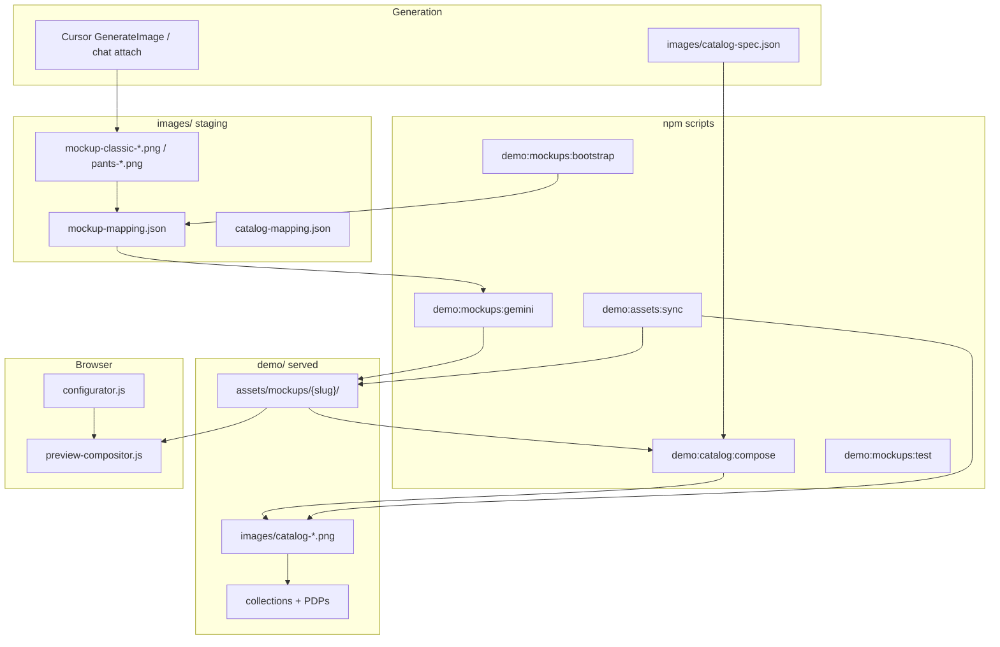

# Mockup Asset Pipeline (no photographer)

> **Status:** Active for Stage D demo  
> **Skill:** `.cursor/skills/rs-mockup-image-generation/SKILL.md`  
> **Spec:** [demo-image-asset-plan.md](../specs/demo-image-asset-plan.md)

## Problem

The uniform configurator needs **grey blank base photos** plus **zone masks** for live tinting. A photographer is not available. RS will use **AI-generated bases + script-derived masks** until production packs arrive.

## Feasibility assessment

| Approach | Feasible? | Quality | Notes |
|----------|-----------|---------|-------|
| One finished PNG per color combo | No | N/A | Thousands of combos; unmaintainable |
| Grey base + derived masks + runtime tint | **Yes** | Good for demo | Shipped in `preview-compositor.js` |
| Separate Gemini mask PNGs | **No** | Poor | Misalign with bases; causes solid color blocks |
| AI grey blanks + `mockup-mask-builder.js` | **Yes** | Good | Pixel-aligned masks from same base |
| Catalog heroes from tinted mockups | **Yes** | Consistent | `scripts/compose-catalog-hero.js` |
| 10 catalog SKUs (jerseys + pants) | **Yes** | Good | Mix of generated + composed heroes |

**Verdict:** Fully feasible for localhost demo and client UX validation. Production should still replace packs with photographer deliverables per [uniform-mockup-asset-brief-photographer.md](../specs/uniform-mockup-asset-brief-photographer.md).

## Architecture



## Two tracks

### Track 1: Configurator mockup packs (Priority 1)

| Slug | Bases needed | Masks | Compositor |
|------|--------------|-------|------------|
| `classic-button` | front + back grey jersey | body, sleeve, collar (derived) | `MOCKUP_PACKS` |
| `pants-classic` | front + back grey pants | pants, pants_stripe (derived) | `MOCKUP_PACKS` |

Ingest: `scripts/ingest-gemini-mockups.js` copies bases from `images/mockup-mapping.json`, then `scripts/lib/mockup-mask-builder.js` derives masks.

**Do not** commit separate AI mask PNGs for jerseys. Pants masks are also derived from bases (stripe zone uses heuristics on side panels).

### Track 2: Catalog heroes (Priority 2)

10 RS customizable SKUs at **$450 standard / $650 customized**:

| # | SKU slug | Type | Hero source |
|---|----------|------|-------------|
| 1 | `jersey-rs-blank-blanco` | Jersey | Blank white photo |
| 2 | `jersey-rs-borgona-negro` | Jersey | AI / attached |
| 3 | `jersey-rs-estrellas-rojo` | Jersey | AI / attached |
| 4 | `jersey-rs-navy-pinstripe` | Jersey | Composed from mockup |
| 5 | `jersey-rs-royal-azul` | Jersey | Composed from mockup |
| 6 | `jersey-rs-verde-militar` | Jersey | Composed from mockup |
| 7 | `pants-rs-blanco` | Pants | Composed from pants pack |
| 8 | `pants-rs-negro` | Pants | Composed from pants pack |
| 9 | `pants-rs-navy-franja` | Pants | Composed from pants pack |
| 10 | `pants-rs-gris-rayas` | Pants | Composed from pants pack |

Catalog images live in `demo/images/catalog-*.png`. Not used for tinting.

## Commands

```bash
npm run demo:mockups:bootstrap   # Copy demo pack sources -> images/ if missing
npm run demo:mockups:gemini      # Ingest bases + derive masks
npm run demo:mockups:test        # Offline tint sanity check
npm run demo:catalog:compose     # Build catalog heroes from mockup packs
npm run demo:assets:sync         # Catalog mapping + mockup ingest
npm run demo:build-check         # Validate demo contracts
npm run demo                     # localhost:3456
```

## Validation gates

1. `classic-button` pack: `front-base.png`, all masks, `placement.json` with `tintEnabled: true`
2. `pants-classic` pack: same structure for pants zones
3. Builder: change body/sleeve color -> visible tint within 200ms
4. Builder: pants template -> pants zones tint
5. `npm run demo:build-check` passes
6. Collection shows 10+ RS custom products with dual pricing

## Related

- [uniform-configurator.md](./uniform-configurator.md)
- [demo-image-asset-plan.md](../specs/demo-image-asset-plan.md)
- `demo/assets/mockups/README.md`
