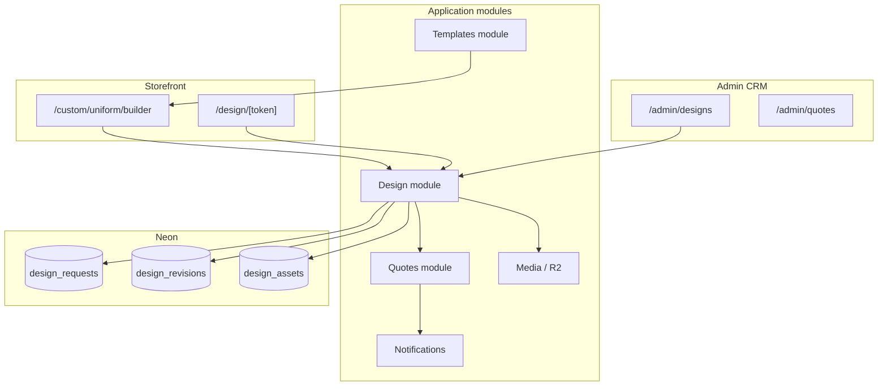
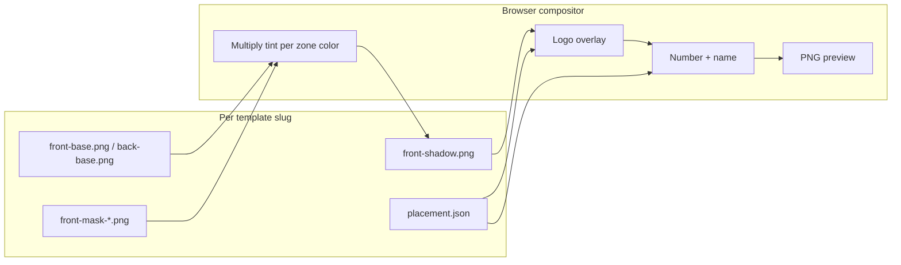

# Uniform Configurator Architecture

> **Status:** In progress (Phase A demo live; UX-B2 awaiting client mockup assets)  
> **ADR:** [ADR-011-configurator-first](./decisions/ADR-011-configurator-first.md)  
> **Spec:** [uniform-configurator-phase-a.md](../specs/uniform-configurator-phase-a.md)  
> **UX:** [uniform-configurator-ux-improvements.md](../specs/uniform-configurator-ux-improvements.md)  
> **Photographer brief:** [uniform-mockup-asset-brief-photographer.md](../specs/uniform-mockup-asset-brief-photographer.md)  
> **No-photographer pipeline:** [mockup-asset-pipeline.md](./mockup-asset-pipeline.md)  
> **Local preview:** `npm run demo` -> http://localhost:3456/custom/uniform/builder.html

## Problem

RS is a B2B supplier moving to D2C. ~95% of orders are **custom uniforms** (jersey, pants, set). There is **no warehouse inventory**. Sales lose time in WhatsApp loops between what the client wants and what the designer applies before production OK.

## Product goal

The website is a **design intake + approval system**, not a stock catalog.

```
Cliente -> Configura prenda -> Preview -> Envía
Admin   -> Recibe spec completo (JSON + logos + preview) -> Revisa / ajusta -> Cliente aprueba -> Cotización
```

---

## Delivery phases

| Phase | Where it runs | Customer sees | Backend |
|-------|---------------|---------------|---------|
| **A - Demo local** | `demo/` static | 4-step wizard + photo/canvas preview | `localStorage` + mock admin |
| **A2 - Layered preview (UX-B2)** | `demo/` | Mask-based tint on RS blank photos, plus a curated AI-photo variant bank for popular jersey/pants combos (see [variant-bank-spec.md](../specs/variant-bank-spec.md)) | Client asset pack (see photographer brief) |
| **B - Wave 0 API** | `app/` Next.js | Same UX, real submit | Neon + `POST /api/design-requests` |
| **C - Approval** | `app/` | Share link `/design/[token]` | Revisions + email |
| **D - Rich preview (prod)** | `app/` | Same compositor as A2; assets on R2 | Server render optional; CDN for template packs |

**Rule:** Ship Phase A on localhost first. Do not wait for Prisma or R2 to validate UX with the client.

**Status (2026-07):** Phase A and A2 are live in `demo/` and are the only deployed part of this system. Phase B has **not started** - `app/`'s current Prisma schema and home page still reflect the pre-configurator retail-catalog model from `wave-zero-quote-crm.md` (no `DesignRequest`, `DesignRevision`, `DesignAsset`, or `UniformTemplate` models; no configurator UI). Phases C and D are not started anywhere.

**Target design note (2026-07, Priority 1 - new customers work):** the configurator's curated variant-bank photo manifest becomes a **shared asset pipeline** with the catalog PDP - the same `demo/assets/variant-bank/{slug}/manifest.json` that drives builder color selection also drives the jersey PDP's swatch strip (`ProductVariant.swatchImageUrl` in `app/`). One asset generation pass serves both surfaces. See [variant-bank-spec.md](../specs/variant-bank-spec.md) "Shared pipeline with catalog PDP swatches" section and the new-requirements roadmap plan for the `Manga Normal` / `Manga Raglan` catalog restructuring this feeds.

---

## System context (Phase B+)



---

## Module boundaries

### Templates module (evolves from Catalog)

| Responsibility | Notes |
|----------------|-------|
| Base models | Jersey, pants, cap, uniform set |
| Template metadata | Slug, thumbnail, `spec_schema` (color zones, logo slots) |
| No stock | `active` flag only; remove inventory semantics from UX |

**Public:** `GET /api/templates`, `GET /api/templates/[slug]`

### Design module (new)

| Responsibility | Notes |
|----------------|-------|
| Create design request | From builder submit |
| Store structured spec | Colors, placements, roster, decoration |
| Assets | Logo uploads (PNG/SVG/PDF), references |
| Preview | Generated PNG (client-side Phase A; server Phase D) |
| Revisions | Version history, client feedback, approval |
| Convert to quote | Staff action from approved design |

**Public:** `POST /api/design-requests`, `GET /api/design-requests/[token]` (approval)  
**Staff:** `GET /api/admin/design-requests`, `PATCH .../status`, `POST .../revisions`

### Quotes module (existing)

- `Quote.designRequestId` optional FK
- Line items reference template + customization JSON snapshot at quote time

---

## Data model (Prisma deltas)

```prisma
enum DesignStatus {
  draft
  submitted
  in_review
  revision_requested
  approved
  converted_to_quote
  cancelled
}

enum TemplateCategory {
  jersey
  pants
  cap
  uniform_set
}

model UniformTemplate {
  id          String           @id @default(uuid())
  slug        String           @unique
  name        String
  category    TemplateCategory
  thumbnailUrl String?
  specSchema  Json             // color zones, logo slots (see spec)
  active      Boolean          @default(true)
  sortOrder   Int              @default(0)
}

model DesignRequest {
  id            String       @id @default(uuid())
  status        DesignStatus @default(submitted)
  templateId    String
  customerId    String?
  contactName   String
  contactEmail  String
  contactPhone  String?
  spec          Json         // full builder output
  previewUrl    String?
  approvalToken String       @unique
  quoteId       String?
  createdAt     DateTime     @default(now())
  updatedAt     DateTime     @updatedAt

  template   UniformTemplate @relation(...)
  customer   Customer?
  revisions  DesignRevision[]
  assets     DesignAsset[]
}

model DesignRevision {
  id              String   @id @default(uuid())
  designRequestId String
  version         Int
  spec            Json
  previewUrl      String?
  clientFeedback  String?
  approvedAt      DateTime?
  createdByStaff  Boolean  @default(false)
}

model DesignAsset {
  id              String @id @default(uuid())
  designRequestId String
  kind            String // logo_chest, logo_sleeve, reference
  fileName        String
  mimeType        String
  storageUrl      String
  placement       Json?  // x, y, scale, zone id
}
```

`Lead.payload` remains for backward compatibility; new submits use `design_requests` as source of truth.

---

## Builder UX (4 steps - shipped)

The original 6-step design below was superseded by the UX-B1 redesign in [uniform-configurator-ux-improvements.md](../specs/uniform-configurator-ux-improvements.md) and is what's actually implemented in `demo/custom/uniform/builder.html` today. Kept for history; do not treat the 6-step table further down as current.

| Step | ID | Captures |
|------|-----|----------|
| 1 | `Tu pedido` | Order mode (pedido chico 6-11 / equipo 12+), product type, template. Only `jersey` product type and the `classic-button` / `pants-classic` templates are enabled for the demo; others show "No disponible en este DEMO." |
| 2 | `Apariencia` | Color combo - curated preset selector when the template has a curated photo variant bank (`classic-button`, `pants-classic`), otherwise free-form color pickers per zone. Logo upload, team name. |
| 3 | `Equipo` | Roster table (Nombre / Numero / Talla) as the source of truth, with add/remove row controls; "Cantidad por talla" is a read-only summary computed from the roster; Tipo de trabajo (Bordado, DTF, TPU, 3D DTF, Sublimado). Enforces a 6-unit minimum order. |
| 4 | `Revisar y enviar` | Summary cards, spec JSON detail, contact fields, consent, submit |

**Target addition (2026-07, Priority 1 - gender sizing):** Step 1 (`Tu pedido`) gains a Dama/Caballero gender selector alongside product type and template, feeding `ProductVariant.gender`. Not yet built - tracked in the new-requirements roadmap plan, `gender-sizing` todo. Uses the same XS-XXL label set with a gender-specific measurement chart, per [baseball-store-glossary.md](../domain/baseball-store-glossary.md).

**Target addition (2026-07, Priority 1 - Manga Raglan):** a second curated template (`raglan`, Manga Raglan sleeve model) is planned alongside `classic-button` (Manga Normal) in Step 1's template picker, once its base mockup photos, masks, and curated combo photos exist - see [variant-bank-spec.md](../specs/variant-bank-spec.md). Until that asset pipeline ships, `raglan` stays out of `DISABLED_TEMPLATE_SLUGS`' inverse (i.e. it does not exist as a selectable option yet, distinct from `pro-pinstripe`/`mexico-stars` which exist but are disabled for lack of a curated bank).

### Builder UX (6 steps - superseded, historical only)

| Step | ID | Captures |
|------|-----|----------|
| 1 | `product` | Jersey / pants / set / cap |
| 2 | `template` | Pick base model (card grid with thumbnail) |
| 3 | `colors` | Body, sleeves, pinstripes, pants pipe (palette + hex) |
| 4 | `branding` | Logo upload(s), placement zone, team name text |
| 5 | `roster` | Size grid + player table (name, number, size) |
| 6 | `review` | Decoration type, qty, contact, consent, **live preview** |

**Output `spec` JSON** (versioned schema `uniform_spec_v1`):

```json
{
  "version": "1",
  "templateSlug": "classic-button-jersey",
  "productType": "uniform",
  "colors": { "body": "#FFFFFF", "sleeve": "#ED090D", "pants": "#000000" },
  "logos": [{ "zone": "chest_left", "fileName": "escudo.png" }],
  "roster": [{ "name": "Garcia Lopez", "number": "12", "size": "M" }],
  "decoration": "embroidery",
  "quantity": 12,
  "notes": ""
}
```

---

## Preview engine (phased)

### Phase A - Demo (shipped)

| Piece | Technology |
|-------|------------|
| UI | 4-step wizard (Tu pedido / Apariencia / Equipo / Revisar) |
| Preview | HTML `<canvas>` + `RSPreview.render()` in `preview-compositor.js` |
| Photo source | Placeholder product shots from `demo/images/` mapped by `templateSlug`; curated real AI-generated photos from `demo/assets/variant-bank/{slug}/` for popular combos (`variant-bank.js` lookup, falls back to live tinting) |
| Color apply | Curated combos: pre-rendered photo swap, no runtime tinting. Uncurated combos: approximate zone shapes (rect/ellipse) with `multiply` blend |
| Views | Single canvas; tab toggle `front` / `back` (not stacked SVGs) |
| Back text | Number + team name from roster; back photo or flipped front |
| Logo | User upload drawn on chest (front) |
| Export | `canvas.toDataURL()` on submit -> admin preview |

Files: `demo/js/configurator.js`, `demo/js/preview-compositor.js`, `demo/css/configurator.css`, `demo/custom/uniform/builder.html`

**Limitation:** placeholder photos include existing prints; zones are geometric approximations. Acceptable for UX validation only.

### Preview engine (layered PNG) - target (UX-B2 / Phase D)

Client (photographer + retouch) delivers a **template asset pack** per model. See [uniform-mockup-asset-brief-photographer.md](../specs/uniform-mockup-asset-brief-photographer.md).



| Step | Operation |
|------|-----------|
| 1 | Draw backdrop + fit base image to canvas |
| 2 | For each color zone in `spec.colors`, fill mask region with hex using `multiply` |
| 3 | Overlay shadow/texture layer (preserve folds) |
| 4 | Front: draw uploaded logo per `placement.json` zone |
| 5 | Back: draw roster number and name per placement |
| 6 | Export PNG for `DesignRequest.previewUrl` |

**Renderer evolution:**

| Version | Module | Trigger |
|---------|--------|---------|
| v0 (current) | `preview-compositor.js` | `previewMode: "photo-approx"` |
| v1 (UX-B2) | `LayeredPreviewRenderer` in same file or split | Asset pack present under `demo/assets/mockups/{slug}/` |
| v2 (prod) | Optional server compositor (sharp/node) | Large batches, PDF quotes, identical render server-side |

**Fallback:** if mask files missing for a slug, compositor falls back to v0 photo-approx and logs `previewMode: "photo-approx"`.

### Template asset storage

| Environment | Path | Notes |
|-------------|------|-------|
| Demo | `demo/assets/mockups/{slug}/` | Committed or copied from client ZIP |
| Production | R2 bucket `rs-template-assets/{slug}/` | URLs in `UniformTemplate.specSchema` |
| Thumbnails | `demo/images/` or R2 | Marketing cards only; not used for tinting |

### `specSchema` asset manifest (per template)

Stored on `UniformTemplate.specSchema` (JSON):

```json
{
  "colorZones": ["body", "sleeve", "collar"],
  "preview": {
    "mode": "layered-png",
    "views": ["front", "back"],
    "assets": {
      "front": {
        "base": "front-base.png",
        "shadow": "front-shadow.png",
        "masks": {
          "body": "front-mask-body.png",
          "sleeve": "front-mask-sleeve.png",
          "collar": "front-mask-collar.png"
        }
      },
      "back": {
        "base": "back-base.png",
        "shadow": "back-shadow.png",
        "masks": {
          "body": "back-mask-body.png",
          "sleeve": "back-mask-sleeve.png"
        }
      }
    },
    "placement": "placement.json"
  }
}
```

Color zone ids must match builder `COLOR_ZONES` in `configurator.js` (`body`, `sleeve`, `collar`, `pants`, `pants_stripe`, plus model-specific zones).

### Phase D - Production storage

- Template packs on R2; signed URLs for admin download of originals
- Composited preview PNG on submit -> R2 -> `DesignRequest.previewUrl`
- Optional server-side re-render for quote PDF attachment (same manifest)

---

## API contracts (Wave 0)

| Method | Path | Auth | Body |
|--------|------|------|------|
| GET | `/api/v1/templates` | public | - |
| POST | `/api/v1/design-requests` | public | `CreateDesignRequestSchema` |
| GET | `/api/v1/design-requests/:token` | token | - |
| POST | `/api/v1/design-requests/:token/approve` | token | feedback optional |
| GET | `/api/v1/admin/design-requests` | staff | filters |
| POST | `/api/v1/admin/design-requests/:id/to-quote` | staff | - |

Rate-limit `POST /design-requests`. Validate file MIME and max size (5 MB demo, 10 MB prod).

---

## Admin screens

| Route | Content |
|-------|---------|
| `/admin/designs` | Inbox table: status, template, qty, contact, date |
| `/admin/designs/[id]` | Preview image, spec JSON viewer, assets download, roster table, "Create quote" |
| `/admin/quotes/detail` | Link back to design request |

Stage D mock: `demo/admin/designs.html` + update `detail.html` with sample spec from sessionStorage.

---

## Integration map (repo execution order)

```
1. docs (this file + spec + photographer brief)  [done]
2. demo/assets/mockups/{slug}/       [client ZIP -> UX-B2]
3. demo/assets/templates/*.svg       [Phase A fallbacks]
4. demo/custom/uniform/builder.html  [wizard UI]
5. demo/js/configurator.js           [state machine + preview]
6. demo/js/preview-compositor.js     [v0 photo -> v1 layered]
7. demo/admin/designs.html           [mock inbox]
8. demo/index.html                   [CTA -> builder]
9. scripts/verify-demo.js            [contract checks]
10. packages/db/prisma schema + migration            [Phase B]
11. apps/web + apps/admin API routes + services       [Phase B]
12. apps/web Next.js pages                            [Phase B - replaces demo]
```

Paths above reflect the [ADR-014](./decisions/ADR-014-monorepo-two-apps.md) monorepo split - the configurator's public builder UI lands in `apps/web`, and any staff-side design inbox review lands in `apps/admin`.

Local smoke after step 6:

```powershell
npm run demo:build-check
npm run demo
# http://localhost:3456/custom/uniform/builder.html
```

---

## Images and assets

**Deliverable for photographer / retouch:** [uniform-mockup-asset-brief-photographer.md](../specs/uniform-mockup-asset-brief-photographer.md)

| Asset | Demo (localhost) | Production |
|-------|------------------|------------|
| Template thumbnails | `demo/images/jersey*.webp` | RS marketing photos per model |
| Preview base + masks | `demo/assets/mockups/{slug}/` when delivered; else `demo/images/` approx | R2 template pack per slug |
| Preview compositor | `preview-compositor.js` (v0 approx -> v1 layered) | Same JS; optional server render |
| Logos | User upload in browser | R2 `design_assets` |
| Fonts (numbers) | System font / placeholder | Client `.otf` files |
| Fabric palette | Hardcoded swatches in `configurator.js` | `fabric-palette.pdf` / CSV from RS |

**Minimum client pack to unlock UX-B2:** 1 jersey slug (`classic-button` recommended): front + back base, 3 front masks, 2 back masks, shadow layers.

**Do not** scrape New Era, Idink, or MLB product images for production. Demo placeholders in `demo/images/` are labeled temporary only.

---

## Out of scope (later waves)

- Real-time pricing engine
- 3D rotation preview
- Illustrator export
- Inventory / stock
- B2B dealer portal (separate login)

## Related

- [uniform-mockup-asset-brief-photographer.md](../specs/uniform-mockup-asset-brief-photographer.md) - handoff to photographer
- [uniform-configurator-ux-improvements.md](../specs/uniform-configurator-ux-improvements.md) - UX-B1/B2/B3 phases
- [custom-uniform-decoration.md](../domain/custom-uniform-decoration.md)
- [user-journeys.md](../domain/user-journeys.md)
- [wave-zero-quote-crm.md](./wave-zero-quote-crm.md)
- [01-module-map.md](./01-module-map.md)
- [variant-bank-spec.md](../specs/variant-bank-spec.md) - shared asset pipeline with catalog PDP swatches
- [decisions/ADR-012-customer-accounts.md](./decisions/ADR-012-customer-accounts.md)
