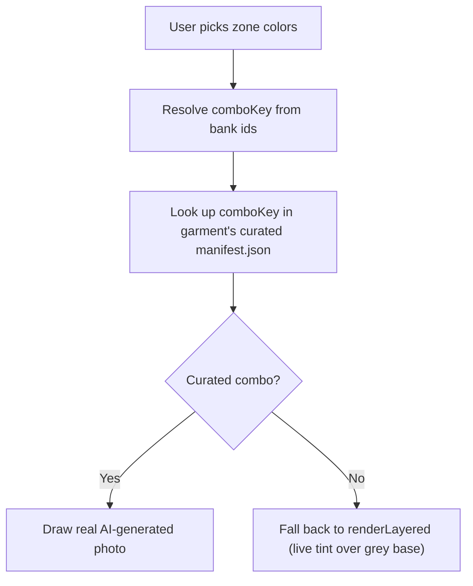

# Variant Bank (configurator curated photos + live tint fallback)

> **Command:** `npm run demo:variant-bank:build`
> **Runtime:** `demo/js/variant-bank.js` + `preview-compositor.js`
> **Build script:** `scripts/build-curated-variant-manifest.js`

## Problem

Runtime mask tint looks like a digital filter in the builder. The client expects
**real product photos** that update as they pick zone colors, not a tinted overlay
on the same grey base.

The first attempt pre-rendered the full combinatoric bank (343 body/sleeve/collar
triples) by tinting the same grey mockup base offline. That did not solve the
problem: the offline-tinted PNGs and the live-tint fallback share the same base
photo and blend method, so they look identical to the user. Generating more tinted
PNGs does not make them look more like a photo.

## Strategy (current)

| Layer | Decision |
|-------|----------|
| Approach | **Curated set of real AI-generated photos**, not full combinatorics |
| Jersey combos | 12 curated triples (7 solids + 5 classic contrast combos) x 2 views = 24 photos |
| Pants combos | 8 curated pairs (4 solids + 4 stripe contrast combos) x 2 views = 16 photos |
| Uncurated combos | Fall back automatically to live tint (`renderLayered`), already implemented |
| Base photo | Grey mockup base per garment (`demo/assets/mockups/{slug}/{front,back}-base.png`), used only as a pose/framing reference for AI generation - not composited at runtime for curated combos |
| Generation | Cursor `GenerateImage`, staged in `images/variant-photos/{slug}/` |
| Post-processing | Offline script `scripts/build-curated-variant-manifest.js` (resize, write manifest) |
| Runtime | Lookup manifest by comboKey -> draw pre-rendered photo if curated, else reject and let the caller fall back |

## Bank colors (shared across garments)

| ID | Hex | Maps from palette |
|----|-----|-------------------|
| wht | #FFFFFF | white, light gray |
| blk | #000000 | black |
| red | #ED090D | RS red, tinto, orange |
| nav | #1e3a8a | navy |
| roy | #2563eb | royal, sky |
| grn | #4a5d23 | military, flag green |
| gry | #525252 | gray |

Config: `images/variant-bank-colors.json` (`mode: "curated-photo"`, `garments.{slug}.curatedCombos`).

## Lookup flow (builder)



Jersey combo key: `bodyId_sleeveId_collarId` (e.g. `wht_red_red`).
Pants combo key: `pantsId_stripeId` (e.g. `wht_red`).

Every color change re-resolves the key from `state.colors`, so the preview always
reflects the current selection.

## File layout

```
demo/assets/variant-bank/
  classic-button/
    manifest.json
    front/wht_red_red.png
    back/wht_red_red.png
    ... (12 curated keys x 2 views)
  pants-classic/
    manifest.json
    front/wht_red.png
    back/wht_red.png
    ... (8 curated keys x 2 views)
```

## Commands

```bash
npm run demo:variant-bank:build   # rebuild manifests from images/variant-photos/{slug}/
npm run demo:build-check
npm run demo
# http://localhost:3456/custom/uniform/builder.html
```

## Adding a curated combo

See "Configurator variant bank" section in
[.cursor/skills/rs-mockup-image-generation/SKILL.md](../../.cursor/skills/rs-mockup-image-generation/SKILL.md)
for the step-by-step: add to `curatedCombos`, generate front/back photos with the
garment's base as reference, stage them, then re-run
`npm run demo:variant-bank:build`.

## Fallback

If a comboKey is not in the curated manifest, `demo/js/variant-bank.js` returns no
URL and `preview-compositor.js` falls back to `renderLayered` (live tint over the
grey mockup base), then `renderPhotoApprox` if the mockup pack itself is missing.

## UI restriction: curated presets only (known limitation, partial fix)

The live-tint fallback described above still exists in the code and is exercised by
`pro-pinstripe` and `mexico-stars` (which have no curated bank at all). But letting
users freely pick per-zone colors for `classic-button` and `pants-classic` meant they
could easily land on an uncurated combo, and the visual jump between a real photo and
a tinted approximation read as inconsistent (different rendering fidelity for the
same UI action).

Instead of building out full per-zone color freedom with tint fallback for these two
garments, `demo/js/configurator.js` restricts color selection to a fixed row of
preset buttons (`renderCuratedPresets`), one per entry in the garment's
`manifest.variants`. Picking a preset sets every zone at once, so `classic-button`
and `pants-classic` can only ever land on a curated combo - the tint fallback path is
effectively unreachable for them in the builder UI (though the code path itself is
untouched and still used by the other two templates).

This is accepted as a demo-scope trade-off: it guarantees visual consistency for the
two garments with a photo bank, at the cost of the originally planned "any color,
live tint fallback" flow. Revisiting this requires either growing the curated combo
set toward the full cross-product, or building a genuinely photorealistic live-tint
renderer that doesn't look like a filter next to the curated photos.

## DEMO scope narrowing: only classic-button + pants-classic are selectable

Building on the preset-only restriction above, `demo/js/configurator.js` now
disables the **base model** cards and **garment type** cards that would put a user
on a template with no curated bank at all:

- `DISABLED_TEMPLATE_SLUGS = ["pro-pinstripe", "mexico-stars"]` - these jersey
  templates have no curated photo bank, so their preview always falls back to
  live tint over the `classic-button` mockup silhouette. Their cards render with
  a grey filter and a "No disponible en este DEMO" badge, and get no click handler.
- `DISABLED_PRODUCT_TYPES = ["uniform", "set", "cap"]` - only single-garment
  flows (`jersey`, `pants`) are wired end to end with curated photos for this
  DEMO. Combined flows (full uniform, uniform + caps) and caps (no cap assets at
  all) show the same grey filter + badge treatment on their cards.
- `syncTemplateForProductType` and the default `state.productType` (`"jersey"`)
  were updated so the wizard never auto-selects a disabled template or garment
  type.
- The classic-button template card thumbnail now points at the curated
  `wht_wht_wht` photo (`/assets/variant-bank/classic-button/front/wht_wht_wht.png`)
  instead of a static burgundy/black stock thumb, so the "Modelo base" grid shows
  the actual default DEMO garment in white.

Disabled cards stay in the DOM (not removed) so re-enabling a template or product
type later is a one-line change to the `DISABLED_*` arrays.

## DEMO scope: free-form color picker hidden, minimum order raised to 6

Because every selectable template is now curated (`classic-button` or
`pants-classic`), `renderColorPanel` always takes the curated-preset branch and
`#color-compact` (the "Zona a personalizar" free-form zone/color picker) is never
shown at runtime. On top of that, the `#color-compact` markup in
`demo/custom/uniform/builder.html` is commented out (not deleted) as a defense in
depth measure, since the color story for this DEMO is fully covered by the preset
combo buttons.

Order size validation (`validateStep` in `configurator.js`) now enforces a global
6-piece minimum order (`builder.v2.error.min_order`) in addition to the existing
12-piece minimum for the "Equipo" order mode. The "Pedido chico" chip label and
hint text were updated to reflect the 6-11 piece range.

## Shared pipeline with catalog PDP swatches (target, Priority 1 - 2026-07)

The jersey catalog restructuring (consolidating `demo/products/jersey-rs-*.html`
into 2 base PDPs - Manga Normal, Manga Raglan) reuses this same manifest instead
of building a second asset pipeline:

- The PDP's color-swatch strip reads the **same** `manifest.variants` list this
  spec already produces for the builder's curated preset buttons
  (`renderCuratedPresets`) - one photo generation pass, two consumers.
- In `app/`, `ProductVariant.swatchImageUrl` stores the same curated photo URL
  used at `demo/assets/variant-bank/{slug}/front/{comboKey}.png`, so a single
  base `Product` row can present multiple color options without one row per
  color.
- **Net-new asset work required, not yet done:** confirm the 3-4 new
  `classic-button` colors (Gris claro, Tinto, Champaña, Gris Oxford) from the
  owner's handwritten note, then generate a brand-new `raglan` garment bank
  from scratch (base photos, masks, curated combos) via
  `.cursor/skills/rs-mockup-image-generation/SKILL.md` - `raglan` has no base
  mockup at all today, unlike the color-only extension needed for
  `classic-button`.

See [uniform-configurator.md](../architecture/uniform-configurator.md) "Target
addition (2026-07, Priority 1 - Manga Raglan)" and the `catalog-jerseys` /
`raglan-assets` / `confirm-colors` todos in the new-requirements roadmap plan.

## Gender sizing (target, Priority 1 - 2026-07)

Gender (Dama/Caballero, default Unisex for caps) is planned as a selector
alongside color, feeding `ProductVariant.gender` on both the PDP and the
builder's Step 1. This does not change the variant-bank photo lookup itself -
gender and color are independent selections - but the PDP swatch strip and
builder preset buttons both need a gender toggle above the color row once this
ships. Not yet built.
